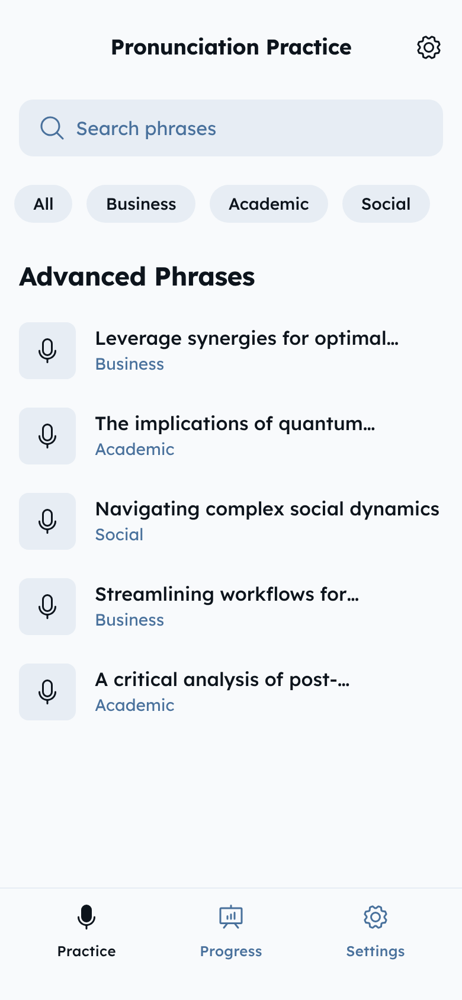

# Build a GTK4 desktop applic


## Detailed Description of the UI

use the  to determine the UI

Certainly. Here is a detailed, **UI/UX breakdown** of the screen you provided (from a user’s perspective, and with technical/structural notes where relevant):

### **1. App Structure & Layout**

* **Overall Style**:

  * Clean, minimalistic, and modern.
  * Uses a light background (white or very pale gray).
  * Rounded corners on interactive elements and a soft, approachable look.
  * Primary color palette is blue and gray, with strong visual hierarchy via font weight and size.

* **Orientation**:

  * The screen appears to be designed for mobile (portrait orientation).
  * UI elements are spaced for touch interaction.

---

### **2. Header**

* **Title**:

  * Bold, centered at the top.
  * Text: `Pronunciation Practice` (uses a large, heavy sans-serif font).

* **Settings Icon**:

  * Top right corner.
  * Small gear icon, circular outline, visually separated from the title.
  * Tappable for settings/preferences.

---

### **3. Search Bar**

* **Placement**:

  * Directly below the header, visually separated with margin.
* **Design**:

  * Large, horizontally centered input field with rounded corners.
  * Light gray fill with subtle shadow or border.
  * Left-aligned magnifying glass/search icon.
  * Placeholder text: `Search phrases` in muted blue-gray.

---

### **4. Category Filters**

* **Filter Chips**:

  * A row of rounded, pill-shaped buttons/chips beneath the search bar.
  * Each filter represents a phrase category:

    * `All` (active or default selection, likely darker or bolder)
    * `Business`
    * `Academic`
    * `Social`
  * Spaced with moderate padding, filled with a light background, text in a muted blue/gray.
  * Selected chip appears bolder or with a more saturated background.

---

### **5. Section Title**

* **Advanced Phrases**:

  * Bold, left-aligned, larger font, acting as a divider/title for the content section.
  * Creates a clear break between navigation controls and main content.

---

### **6. Phrase List**

* **Card/List Items**:

  * Each phrase is displayed as a horizontal row (list style).
  * List uses vertical stacking with ample spacing.

* **Microphone Icon**:

  * Leftmost element, square or rounded-square background.
  * Centered microphone symbol (likely represents “listen” or “record” action).
  * Consistent size for each list item.

* **Phrase Text**:

  * Next to the icon, main phrase is shown in bold, black or near-black text.
  * Phrases are advanced, multi-word, and truncated with ellipsis if too long.
  * One-line display; full text revealed elsewhere (not shown).

* **Category Label**:

  * Directly below or next to the phrase, in smaller, blue text.
  * Indicates the phrase's category (`Business`, `Academic`, `Social`).
  * Lighter font weight for secondary information.

* **Item Layout**:

  * Items are visually grouped and separated with white space; no dividing lines.

---

### **7. Bottom Navigation Bar**

* **Design**:

  * Fixed at the bottom, spans full width.
  * Light background, subtle border or shadow for separation.
  * Contains three equally spaced icons with labels.

* **Tabs**:

  1. **Practice**

     * Microphone icon (likely highlighted/active since this is the current view).
     * Text label: `Practice`.
  2. **Progress**

     * Bar chart or stats icon.
     * Text label: `Progress`.
  3. **Settings**

     * Gear icon.
     * Text label: `Settings`.

* **Interaction**:

  * Tapping these navigates to corresponding screens.
  * Current tab uses stronger color or indicator.

---

## **Functional/Usability Observations**

* **Touch-first**: All controls are finger-friendly and well-spaced.
* **Visual hierarchy**: Title, main action (search/filters), then content.
* **Immediate clarity**: User can see at a glance what the app does—practice advanced pronunciation via phrase selection, with progress and settings readily accessible.
* **Scalability**: Design can easily handle more phrases or categories; additional actions could be layered via long-press, swipe, or expanded cards.
* **Accessibility**: High-contrast text and clear icons; however, further detail needed for accessibility compliance (color contrast, screen reader support).

---

## **Summary Table (for reference)**

| Element        | Description                                                              |
| -------------- | ------------------------------------------------------------------------ |
| Header         | App title (bold), settings icon (top right)                              |
| Search bar     | Wide, rounded input with search icon and placeholder                     |
| Category chips | Pill-shaped, horizontally arranged filter buttons                        |
| Section title  | "Advanced Phrases" in bold, left-aligned                                 |
| Phrase list    | Rows: mic icon + phrase (bold, truncated) + category (smaller blue text) |
| Bottom nav bar | Fixed, 3 tabs: Practice (active), Progress, Settings (icons + labels)    |


Certainly. Here’s a **precise widget mapping** for the provided UI, translated into GTK4 concepts and idioms, suitable for a cross-platform desktop app. This is not code, but an architectural breakdown for each element.

---

## **GTK4 Widget Mapping for “Bobby” Pronunciation Practice UI**

---

### **Main Container**

* **GtkApplicationWindow**

  * The main app window.

* **GtkBox (Vertical, main axis)**

  * Vertical arrangement for stacking header, search, filters, content, and bottom navigation.

---

### **1. Header Section**

* **GtkBox (Horizontal, header row)**

  * **GtkLabel** (left, expanded/centered):

    * Text: “Pronunciation Practice”
    * Large font, bold (`add_css_class("title-1")` or set font property).
  * **GtkButton** (right, icon-only):

    * **GtkImage** (gear icon: [“emblem-system-symbolic”](https://docs.gtk.org/gtk4/class.Image.html) or custom SVG).
    * Flat style, minimal padding.

---

### **2. Search Bar**

* **GtkSearchEntry**

  * Placeholder: “Search phrases”
  * Icon is standard (magnifying glass), left-aligned.
  * Style with rounded corners and appropriate margin.

---

### **3. Category Filters**

* **GtkBox (Horizontal, spacing)**

  * For each category:

    * **GtkToggleButton** or **GtkButton** (pill-shaped):

      * Text: “All”, “Business”, “Academic”, “Social”
      * Use CSS for rounded corners (`add_css_class("pill")`)
      * Selected category visually highlighted (`set_active()` for ToggleButton).

---

### **4. Section Title**

* **GtkLabel**

  * Text: “Advanced Phrases”
  * Large, bold, left-aligned (`add_css_class("heading-2")`).

---

### **5. Phrase List**

* **GtkListBox**

  * Each row: **GtkListBoxRow** containing:

    * **GtkBox (Horizontal, spacing)**

      1. **GtkButton** or **GtkRevealer** (left):

         * **GtkImage** (microphone icon, can be custom SVG or system symbol, e.g., "media-record-symbolic")
         * Style with fixed size and rounded background.
      2. **GtkBox (Vertical)**:

         * **GtkLabel** (phrase text, bold, ellipsized)

           * Use CSS for truncation (`ellipsize=Pango.EllipsizeMode.END`).
         * **GtkLabel** (category, smaller, blue text)

           * Use CSS for color and size.

  * **Spacing**: Set margin/padding between rows for clarity.

---

### **6. Bottom Navigation Bar**

* **GtkBox (Horizontal, bottom, fixed)**

  * Use **GtkRevealer** or **GtkOverlay** to make the nav bar “stick” to the bottom of the window.
  * Three **GtkButton** widgets, equally spaced (expand/fill):

    1. **Practice**:

       * **GtkImage** (microphone icon) + **GtkLabel** (“Practice”)
       * Use CSS or toggle button state for the active indicator.
    2. **Progress**:

       * **GtkImage** (chart/stats icon) + **GtkLabel** (“Progress”)
    3. **Settings**:

       * **GtkImage** (gear icon) + **GtkLabel** (“Settings”)

---

### **Widget Hierarchy Summary**

```plaintext
GtkApplicationWindow
 └── GtkBox (vertical)
     ├── GtkBox (horizontal, header)
     │    ├── GtkLabel ("Pronunciation Practice")
     │    └── GtkButton (GtkImage: gear/settings)
     ├── GtkSearchEntry ("Search phrases")
     ├── GtkBox (horizontal, category filters)
     │    ├── GtkToggleButton ("All")
     │    ├── GtkToggleButton ("Business")
     │    ├── GtkToggleButton ("Academic")
     │    └── GtkToggleButton ("Social")
     ├── GtkLabel ("Advanced Phrases")
     ├── GtkListBox (phrase rows)
     │    ├── GtkListBoxRow
     │    │    └── GtkBox (horizontal)
     │    │         ├── GtkButton (mic icon)
     │    │         └── GtkBox (vertical)
     │    │              ├── GtkLabel (phrase text, bold)
     │    │              └── GtkLabel (category, small/blue)
     │    └── ... (repeat for each phrase)
     └── GtkBox (horizontal, bottom nav)
          ├── GtkButton (mic icon + "Practice")
          ├── GtkButton (chart icon + "Progress")
          └── GtkButton (gear icon + "Settings")
```

---

## **Styling/UX Notes**

* **CSS (Gtk4 CSS):**

  * Use custom CSS for rounded corners, pill-shaped buttons, shadows, and bold/large fonts.
  * Color palette: white/light background, blue for action/selection, muted for secondary text.

* **Responsiveness:**

  * GtkBox widgets with `hexpand`/`vexpand` for flexible layout.
  * List auto-scrolls if content exceeds window height.

* **Accessibility:**

  * All controls support keyboard navigation and screen readers (set accessible labels).
  * Icons have tooltips.


## Requirements and Constraints:**

1. **Purpose:**
   The application enables users to improve their English pronunciation by practicing advanced phrases, hearing them spoken aloud, repeating them, and receiving feedback until their pronunciation is accurate.

2. **Features:**

   * Display advanced English phrases (idioms, collocations, complex sentences) to the user.
   * Use the **OpenAI API** for text-to-speech (TTS) to synthesize and play the target phrase in standard English.
   * Allow the user to record their own pronunciation of the phrase via microphone.
   * Use the **OpenAI API** for speech-to-text (STT) transcription of the user’s recorded audio.
   * Compare the transcribed user attempt to the original phrase, highlighting any differences.
   * Provide feedback indicating which words were omitted, mispronounced, or substituted—based strictly on the transcription comparison (since phoneme-level feedback is not natively supported by these APIs).
   * Let the user retry until the spoken phrase matches the original.
   * Track user progress, storing attempts and displaying performance over time.

3. **Technical Scope and Limitations:**

   * **Platform:**

     * Use GTK4 for cross-platform desktop support (Linux, Windows, macOS where feasible).
     * UI should be native to the desktop, not web-based.
   * **Voice Generation:**

     * Integrate OpenAI API for all TTS functionality. Specify available voices/accents and document any parameters that can be adjusted (speed, pitch, etc.).
   * **Transcription:**

     * Use OpenAI API for STT. Specify real-world accuracy with non-native speakers, latency, and input file restrictions.
   * **Feedback Mechanism:**

     * Feedback is limited by what the APIs return—do not promise phoneme-level error detection unless the API supports it.
     * Emphasize word-level comparison: mismatches, omissions, substitutions.
   * **Privacy and Data Handling:**

     * Clearly state how voice data is handled and whether recordings are retained locally or sent to the cloud for processing (per OpenAI API requirements).
   * **Extensibility:**

     * App architecture should make it straightforward to replace or extend speech APIs if future improvements are available.

4. **User Experience:**

   * GTK4-native design: clear phrase presentation, easy recording and playback, real-time feedback.
   * Accessible and responsive interface with modern design cues.
   * Statistics and progress tracking.
   * Optionally display phonetic transcriptions (IPA) if available from API or via open-source libraries.


---

**Instruction:**
“Generate a detailed GTK4 desktop app  that reflects the above requirements and constraints, focusing on user journey, technical feasibility, and realistic feedback mechanisms, considering the actual capabilities and limitations  OpenAI APIs for TTS and STT. 
